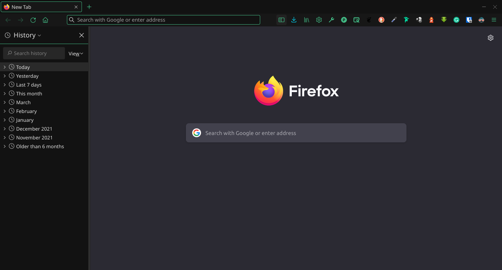

<h1 align="center">
  
   
  Bit Theme for <a href="https://www.mozilla.org/en-US/firefox/">Firefox</a>
</h1>

  
  
  

## Install

- Access `addons.mozilla.org`.
- Search by `Bit Theme: A Dark Theme for Firefox`.
- Select it and press `Install Theme`.
